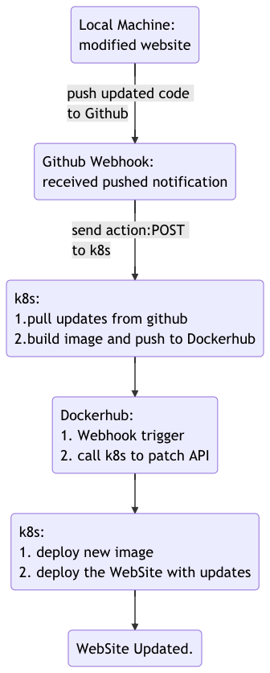

# Kubernetes (k8s) Deployment Controller

This repository demonstrates the auto-deployment of a website with updates in a Kubernetes Engine hosted on Google Cloud Platform. 

## How it works


## Files for auto-deployment (selective)
### *app.py* file

```python
@app.route('/namespace')
```
* create new namespace

```python
@app.route('/deployment')
```
* create new deployments

```python
@app.route('/service')
```
* create new services

```python
@app.route('/build_docker_image', methods=['GET', 'POST'])
```
* run *build_docker_image.sh* while received PUSH from Github

### *build_docker_image.sh* file

```sh
##clone the github repo of WebSite and Dockerfile
git clone https://3caa02e0948b68640d4b36521dc20ab8e63bafb2@github.com/tuyuqi/docker_flask.git /tmp/docker_flask

##get the Dockerhub login infomation
cat /home/yuqi_tu/my_password.txt | docker login --username yuqitu --password-stdin

##build docker image
docker build -t yuqitu/flask-demo:simpleflaskwebsite /tmp/docker_flask/

##push the docker image to the dockerhub for further deployment
docker push yuqitu/flask-demo:simpleflaskwebsite

## remove the directory after pushed
rm -rf /tmp/docker_flask
```

* The github repo of WebSite and Dockerfile can be viewed at https://github.com/tuyuqi/docker_flask.
